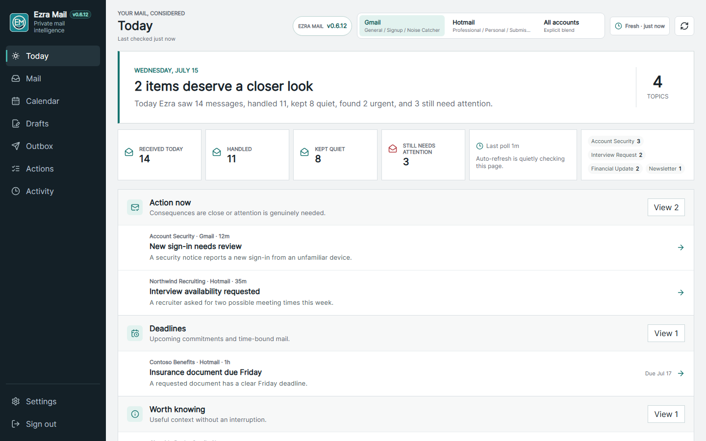

# Ezra Mail


**An email workspace built around the day ahead.**

I started Ezra Mail because I wanted a different way to work through email than
Outlook or Gmail offered. It is a personal project I develop with AI coding
assistance. This repository contains the source you can run on your own computer
or private server, with your own accounts and model.

Ezra brings today's agenda, a fixed morning brief, and messages that need a
decision into one place. Ezra Mail v0.8.2 is an experimental pre-1.0 source release.
It is not a generally supported consumer or business email client. Workplace use
requires your organization's approval.



*Demonstration data illustrating an earlier interface. See the
[project introduction](https://github.com/R3dTh3Ging3r-s-Creations/Ezra-Mail-Info)
for newer desktop and mobile previews.*

## What it does

- Shows today's agenda, a morning brief, and a separate "Since your brief" update.
- Keeps unfinished work visible, including how long messages have been waiting.
- Separates Gmail and Microsoft account workspaces, saved views and local rules.
- Uses a locally configured model for triage, summaries and draft assistance.
- Provides remote-image controls and exact-message review before sending.
- Includes opt-in browser, Web Push and Telegram notifications with privacy controls.

Native installation and notification delivery still need broader real-device
acceptance. The [roadmap](docs/EZRA_MAIL_ROADMAP.md) separates implemented features
from remaining work.

## Run your own copy

Start with the [step-by-step source installation guide](docs/DEPLOYMENT.md), then
[configure your accounts](docs/EMAIL_AGENT_SETUP.md). You need Git, Node.js 22 LTS
and npm. Local AI additionally needs Ollama and a model your hardware can run.
No provider account is required to create your owner login and open the app.

```bash
git clone https://github.com/R3dTh3Ging3r-s-Creations/Ezra-Mail-Self-Hosted.git
cd Ezra-Mail-Self-Hosted
npm ci --ignore-scripts
node scripts/apply-dependency-patches.mjs
```

Continue with configuration, build and first-owner setup in the installation
guide before starting the worker. Guided Windows and Ubuntu installers are
included for evaluation; their broader installation acceptance is still open.

## Where data goes

Mail, calendar records, credentials and attachments belong to your installation,
which may be a server separate from your browser. Ezra is not a hosted mailbox
service. Use a trusted private network; direct internet exposure is unsupported.
Local inference uses your configured Ollama endpoint. Choosing an optional hosted
model sends the relevant content to that model provider.

Microsoft's initial setup requests `Mail.ReadWrite` in addition to `Mail.Read`,
`User.Read` and `offline_access`. Calendar adds `Calendars.ReadWrite`; sending
requires separate `Mail.Send` permission and exact review in Ezra. Gmail has its
own permissions and setup requirements. See the account guide before authorizing.

Optional Telegram delivery uses an external service and is not end-to-end
encrypted. Browser push uses a browser-operated relay. Notification copy is
generic by default; sender and subject require a separate choice.

## Project and license

Created and maintained by Eric Michael Mathews with AI coding assistance.
Screenshots and test fixtures use synthetic data. This source snapshot has its
own clean history and contains no configured user accounts or installation data.

Ezra Mail uses [AGPL-3.0-only](LICENSE), with a
[separate commercial licensing route](COMMERCIAL-LICENSING.md).

- [Privacy](docs/PRIVACY.md) and [terms](docs/TERMS.md)
- [Security reporting](SECURITY.md) and [support](SUPPORT.md)
- [Contributing](CONTRIBUTING.md) and [Contributor License Agreement](CLA.md)

There is no support SLA or guarantee that every provider, browser or installation
is supported. Outside code contributions are not merged until CLA enforcement is
configured and verified.
